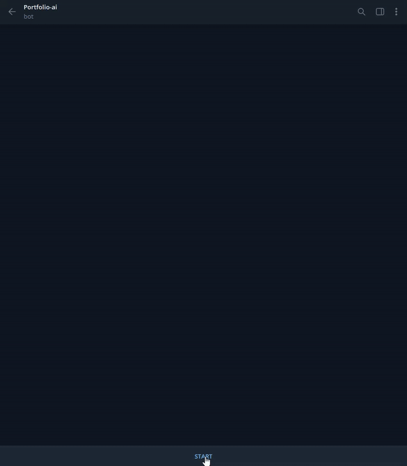

# Portfolio AI (Telegram Finance Bot)

> A financial data engine for tracking personal assets using yfinance and pytefas, featuring a Telegram UI and background scheduling.

<p align="center">
  
</p>

[](LICENSE)

## ⚡ Features
- **AI Portfolio Analysis**: Integrates dynamically with Groq, OpenAI (ChatGPT), Anthropic (Claude), and Google Gemini.
- **TEFAS Mutual Funds (`pytefas`)**: Automatically recognizes 3-letter fund codes and fetches the latest prices.
- **Global & Local Stocks (`yfinance`)**: Automatically recognizes stock tickers and fetches real-time prices.
- **Automated Daily Reports**: Sends you a complete portfolio summary every morning and evening automatically.
- **Weighted Average Cost**: Automatically calculates your new average cost if you buy the same asset multiple times.

## 🏗️ Architecture & Under the Hood
- **Language**: Python 3
- **Libraries**: yfinance, pytefas, sqlite3, telegram-bot
- **Design Pattern**: Modular telegram bot architecture with background scheduling and SQLite storage.

## 📦 Installation

```bash
# Clone the repository
git clone https://github.com/cadakerem/portfolio-ai.git
cd portfolio-ai

# Install requirements
pip install -r requirements.txt
```

## 💻 Usage

```bash
# Start the bot
python main.py
```

**Telegram Commands**:
- `/add THYAO.IS 10 250` (Adds 10 shares of THYAO at 250 TL cost)
- `/remove THYAO.IS` (Removes the asset from your portfolio)
- `/portfolio` (Fetches live market data and lists your current P&L)
- `/settime 09:30 18:00` (Sets your daily report schedule)

## 🤝 Contributing
Contributions, issues, and feature requests are welcome!

1. Fork the repository.
2. Create your feature branch (`git checkout -b feature/AmazingFeature`).
3. Commit your changes (`git commit -m 'Add some AmazingFeature'`).
4. Push to the branch (`git push origin feature/AmazingFeature`).
5. Open a Pull Request.

## 📜 License
This project is licensed under the [MIT License](LICENSE).
